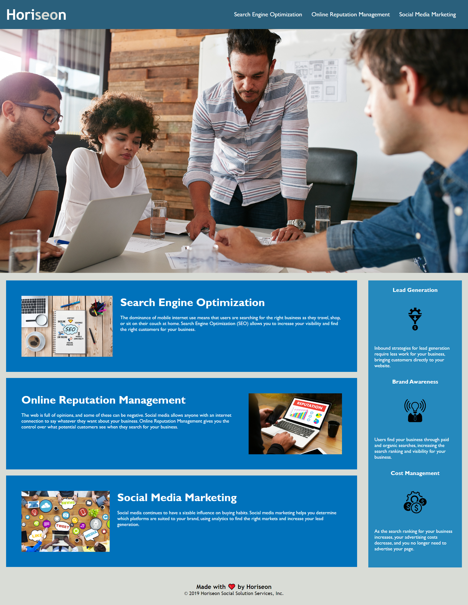

# Horiseon Webpage (Bootcamp Challenge: Week 1)

## Description

The aim of this project was to improve the accessibility of the Horiseon homepage. This was done by modifying the html code through the addition of a descriptive title to the header, through the addition of 'alt' tags to all images, and by introducing semantic elements.

## Installation

N/A

## Usage

N/A

## Credits

N/A

## License

N/A

## https://davidbluelamassu.github.io/Horiseon-Homepage/

